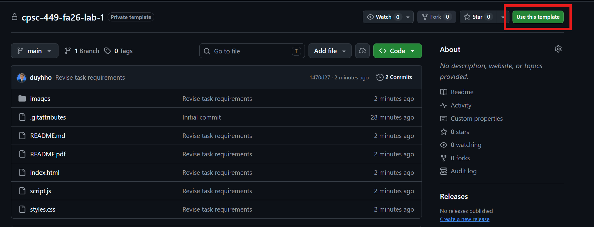
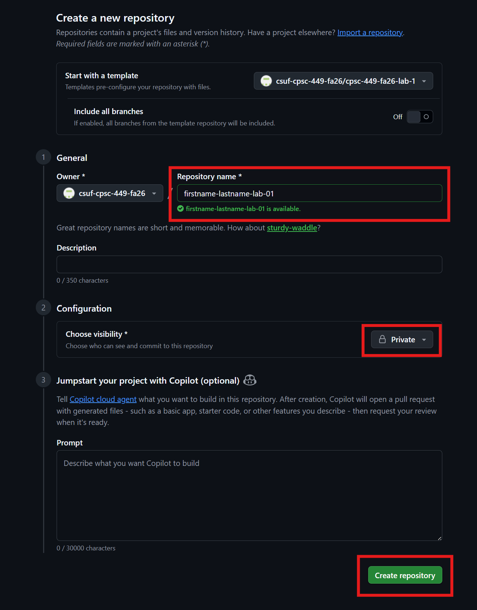
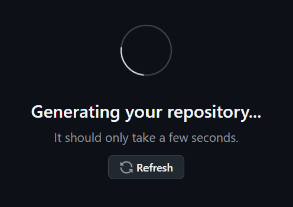
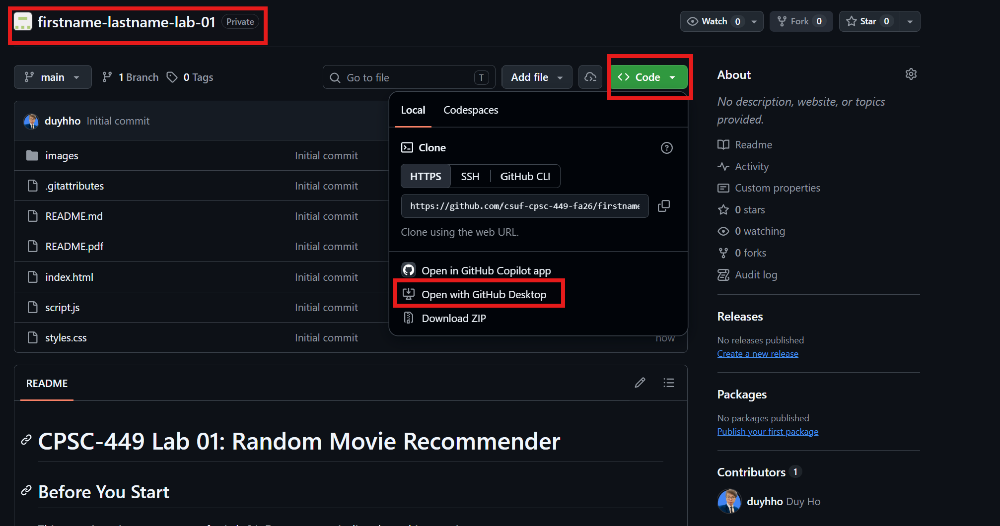
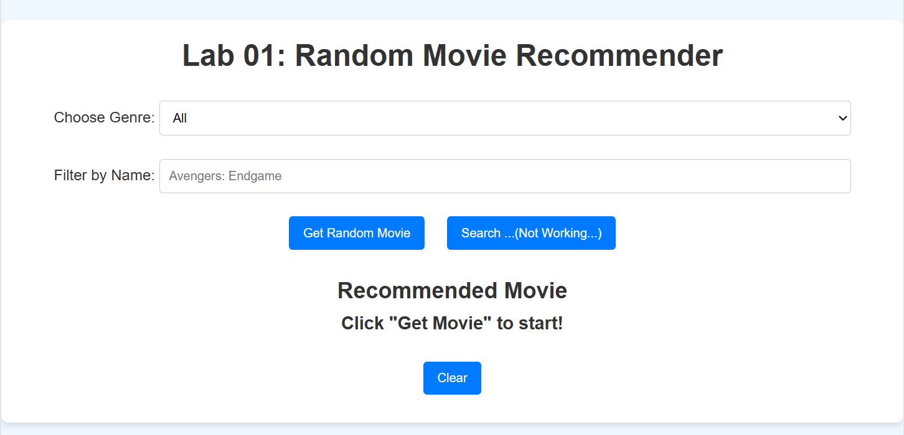
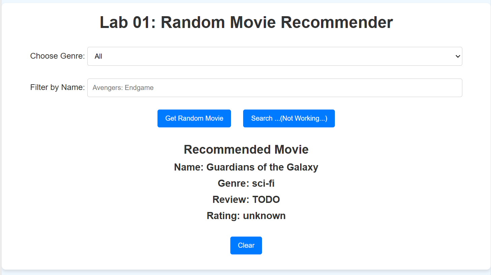
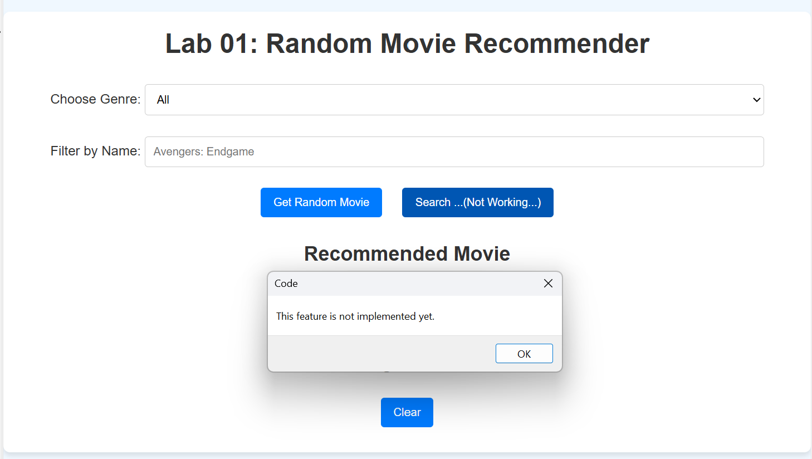

# CPSC-449 Lab 01: Random Movie Recommender

## Before You Start
This repository is a **starter repo** for Lab 01. Do **not** commit directly to this repository.

Instead, create your own copy by using the green **Use this template** button on GitHub. This will create a separate repository under your GitHub username and ownership, which you can freely modify and commit to.

If you provided your GitHub username on Day 1 of class, GitHub should create your copy under the `csuf-cspsc-449-fa26` organization by default. Repositories created under that organization will automatically grant the instructor access.

When creating your repository from the template, name your repo using this format:

```text
firstname-lastname-lab-xx
```

For this lab, replace `xx` with `01`.

### Using the Template
Click **Use this template** from the starter repository.



Set up your new repository under the course organization.



Generate the new repository from the template.



Confirm that the new repository is under your ownership and follows the required naming format.



## Overview
In this lab, you will work with a small frontend-only Random Movie Recommender built with:

- **HTML** for the page structure
- **CSS** for the page appearance
- **JavaScript** for interactivity and data handling

There is no backend server in this lab. The movie data lives directly inside `script.js` as a JavaScript array, and the browser runs all of the logic locally.

The completed application should let a user:

1. Choose a genre from a dropdown menu.
2. Click a button to display a random movie from that genre.
3. Search for a movie by name.
4. Clear the displayed result.
5. Display movie information in the page without refreshing.

## Demo Screenshots

### Demo 1: Default Page
This is the starting page before the user clicks any buttons.



### Demo 2: Random Movie Selected
This is the page after the user clicks **Get Random Movie**.



### Demo 3: Unimplemented TODO Function
This shows the current behavior for one of the unfinished TODO features.



## Set-up and Installation
1. Use the **Use this template** button on GitHub to create your own copy of this starter repository.
2. Name your repository using the format `firstname-lastname-lab-01`.
3. Clone your copy of the repository to your local machine.
4. Open the project folder in VS Code or another code editor.
5. Locate the `index.html` file.
6. Open `index.html` directly in a browser, or serve it using a local server such as **Live Server**:
   - In VS Code, install the Live Server extension if you do not already have it.
   - Right-click `index.html`.
   - Select **Open with Live Server**.
7. Test the starter version before writing code:
   - Try the genre dropdown.
   - Click **Get Random Movie**.
   - Try the search button and notice that it is not fully implemented yet.

## HTML, CSS, and JavaScript Review

### HTML Review
The `index.html` file defines the structure of the page. HTML tells the browser what elements exist on the page, such as headings, labels, dropdowns, inputs, buttons, and paragraphs.

Important HTML elements in this lab include:

- `<select id="genre">`: the dropdown menu used to choose a movie genre.
- `<input id="searchInput">`: the text input where the user types a movie name.
- `<button id="getMovieButton">`: the button that selects a random movie.
- `<button id="searchButton">`: the button that should search for a movie by name.
- `<button id="clearButton">`: the button that clears the displayed result.
- `<p id="movieName">`, `<p id="movieGenre">`, `<p id="movieReview">`, and `<p id="movieRating">`: the display area that JavaScript updates.

The `id` attributes are especially important. JavaScript uses these IDs to find specific HTML elements and change their content.

### CSS Review
The `styles.css` file controls how the page looks. CSS handles layout, spacing, colors, button styles, fonts, borders, and hover effects.

In this lab, CSS is used to:

- Center the application on the page.
- Style the main `.container`.
- Add spacing around the filter and search controls.
- Style the dropdown, input, and buttons.
- Change button color when the user hovers over a button.
- Make the movie result text larger and bold.

You do not need to completely redesign the page, but you may improve the styling if you want. Keep your changes readable and make sure the page remains easy to use.

### JavaScript Review
The `script.js` file controls the behavior of the page. JavaScript reads user input, chooses movies, searches the movie list, and updates the HTML.

This lab uses several important JavaScript concepts:

- **Arrays**: a list-like data structure used to store multiple movie objects.
- **Objects**: each movie is represented as an object with properties such as `name`, `genre`, and `review`. You will add a `rating` property as part of the lab.
- **Functions**: reusable blocks of code that perform a specific task.
- **DOM elements**: HTML elements that JavaScript can read from or update.
- **Event listeners**: code that runs when the user clicks a button.
- **Conditionals**: `if`, `else if`, and `else` logic used to make decisions.
- **Array methods**: methods like `filter()` and `find()` used to search through the movie list.

## Understanding `script.js`

### The `movies` Array
At the top of `script.js`, you will see:

```js
const movies = [
    { name: "The Dark Knight", genre: "action", review: "A masterpiece of action and storytelling." },
    { name: "Inception", genre: "sci-fi", review: "A mind-bending journey into dreams." }
];
```

The full file contains more movies than this example. The important idea is that `movies` is an **array**, which means it stores multiple values in order.

Each value inside the array is a **movie object**. A movie object stores related information together:

- `name`: the movie title
- `genre`: the movie genre
- `review`: a short written review that should be displayed on the page

As part of the lab, you will add one more property to each movie object:

- `rating`: a numeric movie rating from 1 to 5

You can loop through, filter, or search this array to find the movie data you need.

### DOM Element Variables
The lines that use `document.getElementById()` connect JavaScript to the HTML page.

For example:

```js
const searchInput = document.getElementById("searchInput");
```

This tells JavaScript to find the HTML element with `id="searchInput"` and store it in a variable. After that, JavaScript can read what the user typed into the input field.

### Functions
A function is a named block of code that can be reused. This lab includes several functions:

- `getRandomMovie()`: gets the selected genre, filters the movie list, chooses a random movie, and displays it.
- `searchMovie()`: TODO function that should search for a movie by name.
- `displayMovie(movie)`: TODO function that should update the page with the selected movie's information.
- `clearMovie()`: clears the current movie display and resets the search input.

### Event Listeners
At the bottom of `script.js`, the buttons are connected to functions:

```js
getMovieButton.addEventListener("click", getRandomMovie);
searchButton.addEventListener("click", searchMovie);
clearButton.addEventListener("click", clearMovie);
```

This means:

- Clicking **Get Random Movie** runs `getRandomMovie()`.
- Clicking **Search** runs `searchMovie()`.
- Clicking **Clear** runs `clearMovie()`.

## TODO Functions

### TODO 1: `searchMovie()`
The `searchMovie()` function is currently unfinished. Your job is to make it search the `movies` array using the text entered by the user.

This function should:

1. Read the value from `searchInput`.
2. Remove extra spaces with `trim()`.
3. Convert the search term to lowercase with `toLowerCase()`.
4. Check whether the search field is empty.
5. Use the `find()` array method to search for a movie whose name includes the search term.
6. If a matching movie is found, call `displayMovie()` and pass in that movie.
7. If no movie is found, update the page with a clear "not found" message.

Helpful methods:

```js
trim()
toLowerCase()
includes()
find()
```

### TODO 2: `displayMovie(movie)`
The `displayMovie(movie)` function receives one movie object as a parameter.

The function should:

1. Display the movie name in the `movieName` paragraph.
2. Display the movie genre in the `movieGenre` paragraph.
3. Display the movie's written review in the `movieReview` paragraph.
4. Add a numeric `rating` property to every movie object in the `movies` array.
5. Convert the movie's numeric rating into a user-friendly display value.
6. Display that rating in the `movieRating` paragraph.

The starter code already shows where the movie name and genre should be displayed. You need to complete the missing review display, add the missing `rating` data, and complete the rating display logic.

Pay close attention to the data in the `movies` array. Your display logic should use each movie object's written `review` property, and your new numeric `rating` property.

## Instructions
1. Open `script.js`.
2. Find each section marked with `//TODO`.
3. Complete the missing logic in `searchMovie()`.
4. Add a numeric `rating` property to each movie object in the `movies` array.
5. Complete the missing logic in `displayMovie(movie)` so it displays the movie review and rating.
6. Test your work in the browser.
7. Make sure the dropdown, random movie button, search button, and clear button all work correctly.
8. Commit your changes to your own repository, not the original starter repository.

## Submission Requirements
Submit the following:

1. A screenshot showing the dropdown filter and random movie feature working.
2. A screenshot showing the search functionality working.
3. A brief description of the changes you made.
4. A link to your repository created from the template.

**NOTE:** If you do not complete and submit the lab in class for in-person grading by the instructor, you are responsible for decorating and documenting your own `README.md` with screenshots that show completion and functionality.

Before submitting, make sure:

- Your code is committed to your own copy of the repo.
- You did not commit directly to the starter repo.
- Your JavaScript has no console errors.
- The page works after refreshing the browser.
